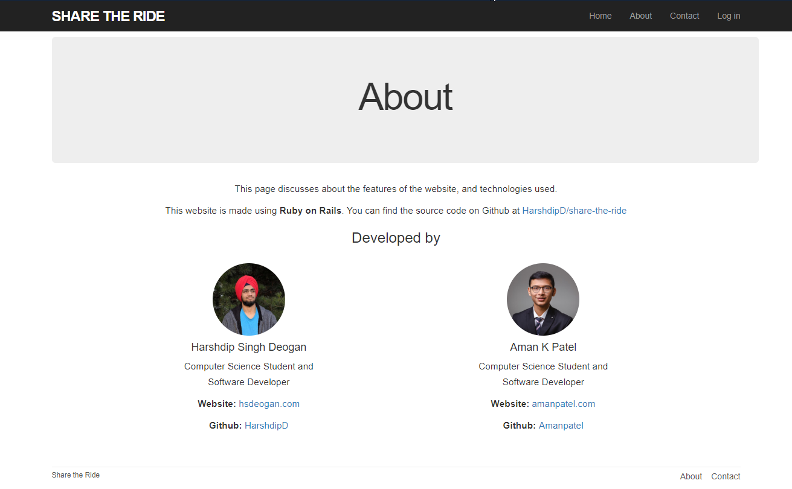

### README

We are creating a completely functional web application using Ruby on Rails which can help people find rides easily. Our aim is to provide a common platform for both riders and customers through which they can have easy access to each other.

### Setup

You can follow [these instructions](https://www.tutorialspoint.com/ruby-on-rails/rails-installation.htm) to install `ruby` and the `rails` framework.

After installing rails, you need to install the dependencies (gems). Navigate to the project directory and run:

`$ bundle install`

Bundler will install all of the project dependencies (located in `Gemfile`) of the project.

Next create the local database using

`$ rails db:setup`

After that you're ready to launch the site using:

`$ rails server` or `$ rails s `

By default, rails will launch the server at [http://localhost:3000](http://localhost:3000).
